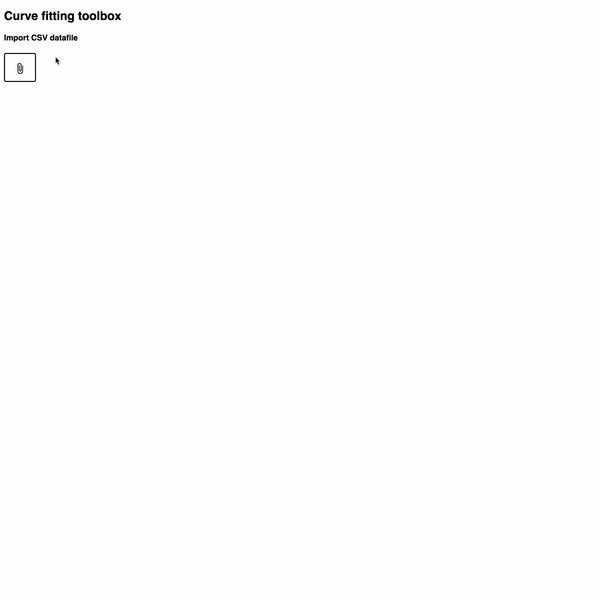
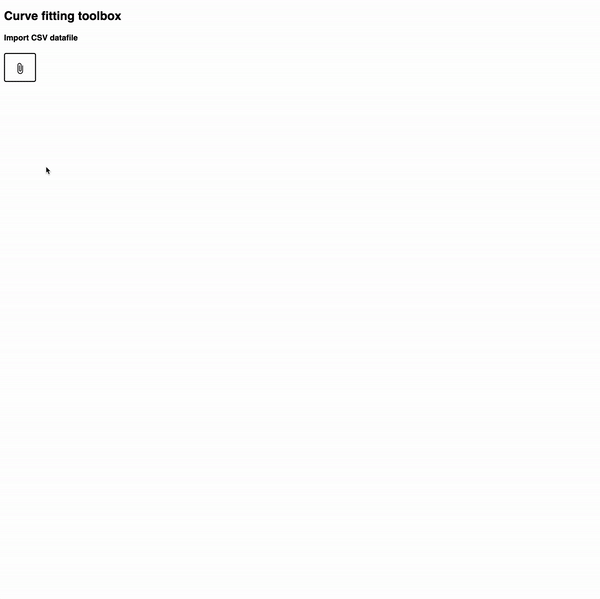

# Curve fitting toolbox

Similar to the fitting toolbox shipped in MATLAB (at least 10 years ago, last time I used it), this single page app works by inviting the user to upload a `csv` datafile, pick two of its columns, one for `x` one for `y`, inputting a functional form `y=f(x)` with some free parameters.

There is freedom for setting the initial value of each of these parameters.

Finally, the user can run the fit, the [optimizer](https://en.wikipedia.org/wiki/Stochastic_gradient_descent#Adam) will run a gradient descent to minimise the [mean squared error](https://en.wikipedia.org/wiki/Mean_squared_error).

Under the hood, the functional expression is transformed to a mathematical graph, where everything is decomposed into atomic mathematical operators and functions. This graph is then _translated_ into a TensorFlow graph.

[You can play with me here.](https://vnherdeiro.github.io/tensorflowjs-curve-fitting-on-graph/)

### Features

- Any function existing within the tfjs API can be used in the function template (`exp`, `log`, `pow`, etc...).
- Visualisation of the data points and the fitted line.
- Goodness of fit metric, R-squared value is printed.
- The fitting process can be interrupted by the user, allowing for regularisation by early stopping.

#### Demo

##### Linear fit

##### Polynomial fit

##### Saturating exponential fit

---

##### Next iteration features

- Giving the user freedom in the optimiser choice, the learning rate and the error to be minimised.
- Offering cross validation by splitting the data into training and validation.
- Providing L2 regularisation.
- Generalising to higher dimensions, not only $$\mathbb{R} \to \mathbb{R}$$ mappings.
- More freedom in data imports: excel format, google sheets, copy-pasting, ...

This project was generated with [Angular 7](https://github.com/angular/angular-cli), using [ECharts](https://ecomfe.github.io/echarts-doc/public/en/index.html) for visualization, [Math.js](https://mathjs.org) & [TensorFlow.js](https://www.tensorflow.org/js) for modelling and training.
